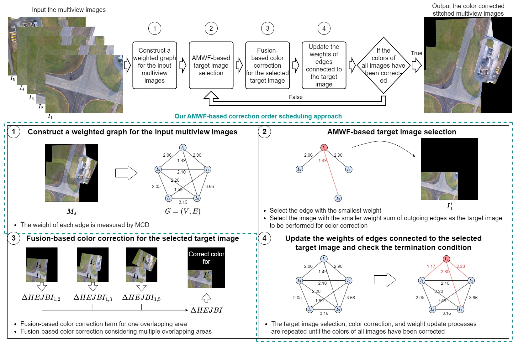
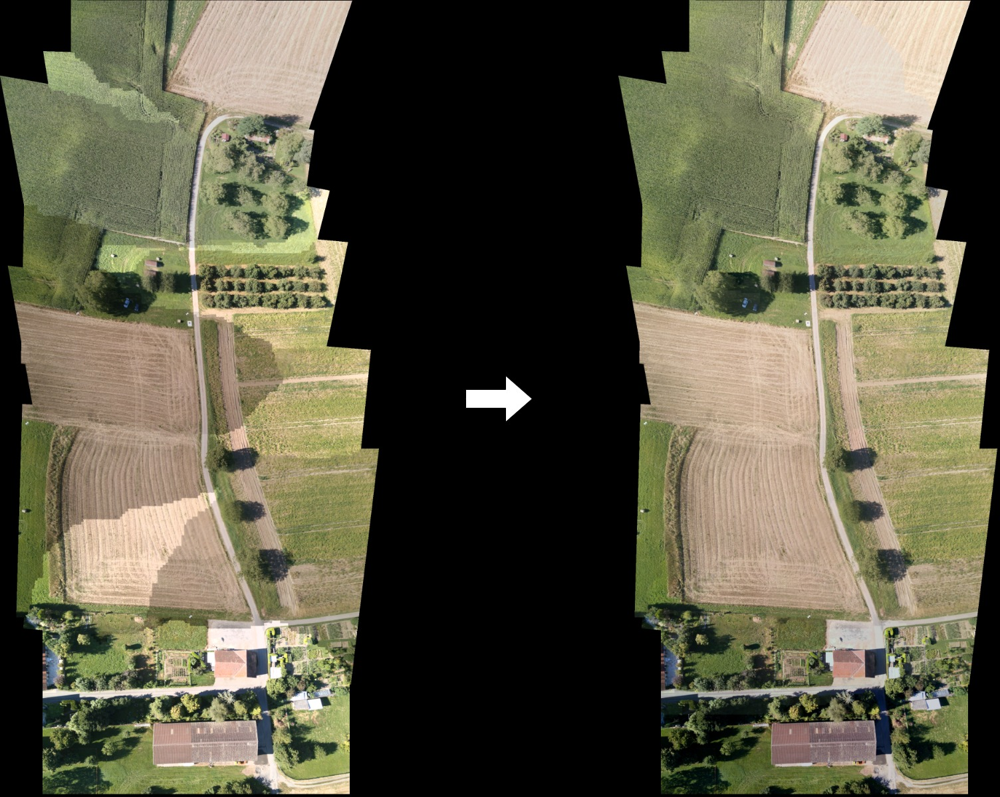

# AMWF-Based Color Correction

"An Effective Fusion Algorithm for Multiview Color Correction Using Adaptive Minimum Weight-First Based Color Correction Order Scheduling Approach" by Kuo-Liang Chung and Che-Yu Lee.

## Introduction

Color correction for the stitched multiview images.

An example of the color correction effects is demonstrated below: 

## Dependencies

* C++ 17
* OpenCV 4.9.0
* OpenMP (optional)

## Environments

* Intel Core i5-12400 CPU clocked at 2.5 GHz, 16GB RAM
* Microsoft Windows 10 64-bit operating system
* Microsoft Visual Studio 2022

## Configuration & Run Tests

The project can be configured by CMake with the given CMakeLists.txt file.

Four input directories are required for program execution:

* "*multiview_warp_result*" : The input multiview images after performing an existing stitching method. The image file "*XX__warped_img.png*" represents the stitched image *XX*.
* "*overlap*" : The overlapping areas of the stitched images in "*multiview_warp_result*". The image file "*XX__YY__overlap.png*" represents the overlapping area between image *XX* and image *YY* ("*YY__XX__overlap.png*" is the same image as "*XX__YY__overlap.png*").
* "*seam*" : The stitching lines of the overlapping areas in "*overlap*". The image file "*XX__YY__seam.png*" represents the stitching line between image *XX* and image *YY* ("*YY__XX__seam.png*" is the same image as "*XX__YY__seam.png*").
* "*mask*" : The areas of the stitched images behind the stitching line of each overlapping area. The image file "*XX__YY__mask.png*" represents the area of image *XX* behind the stitching line "*XX__YY__seam.png*".

Two output directories are required for saving the color corrected results:

* "*AMWF_results*" : The color corrected images of "*multiview_warp_result*" are saved in this directory.
* "*stitched_results*" : The stitched color corrected image ("*AMWF.png*") is saved in this directory.

All 30 testing multiview image sets and the qualitative quality results are available at https://drive.google.com/drive/folders/1EJS0ivVr7g-k_e5nry84cCnQwrP8EjB8?usp=drive_link.

## Contact

If you have any questions, please email us via

Che-Yu Lee : m11115094@mail.ntust.edu.tw

Kuo-Liang Chung : klchung01@gmail.com